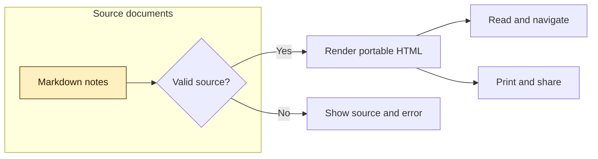
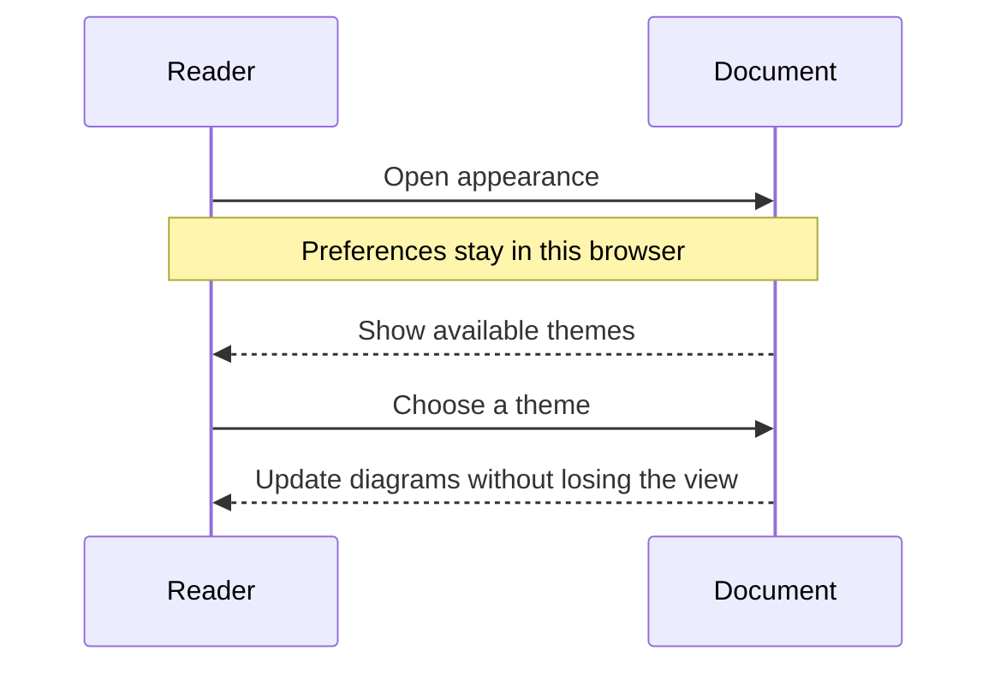
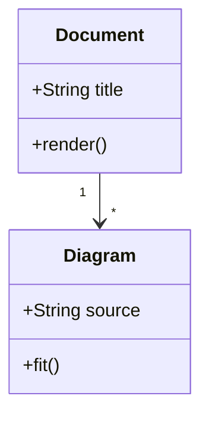
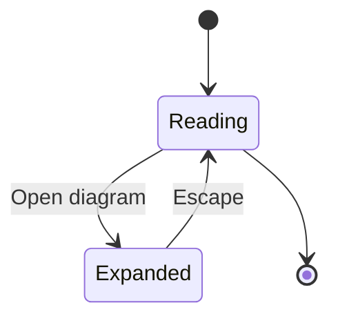
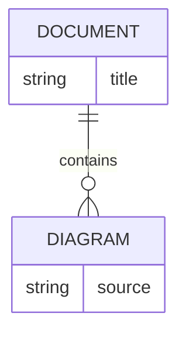
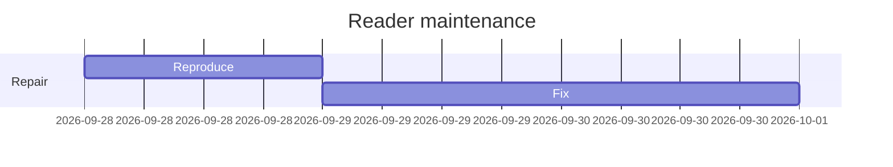
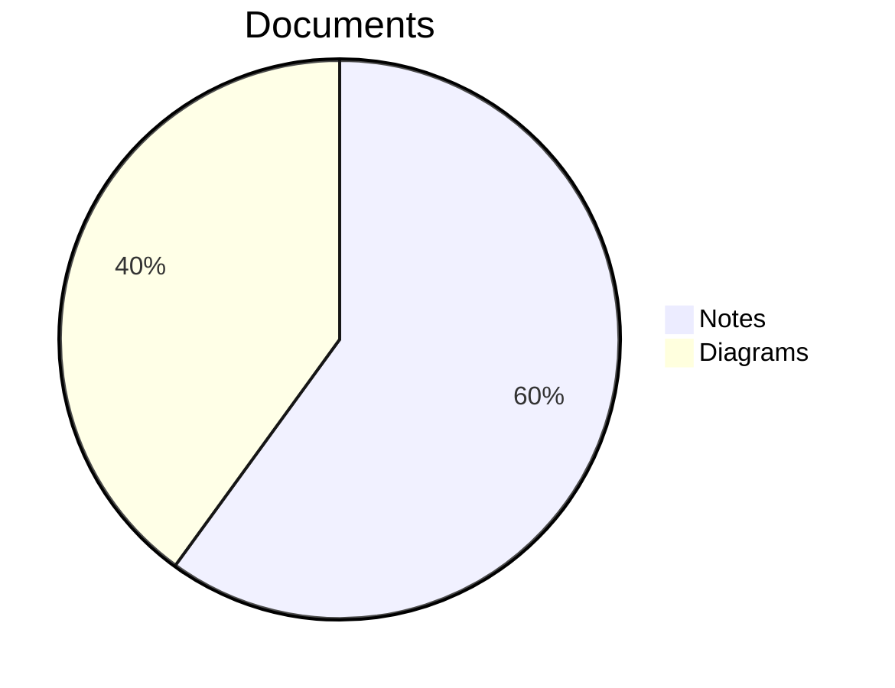
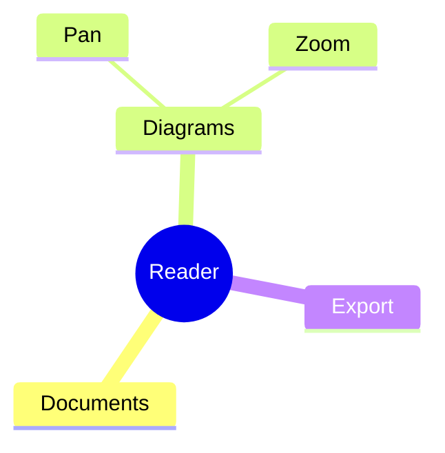
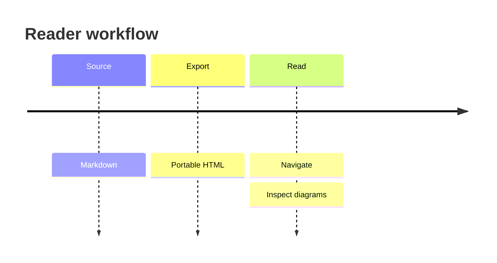
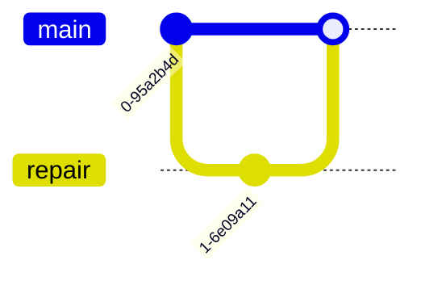

## Flowchart



## Sequence



## Class



## State



## Entity relationship



## Gantt



## Pie



## Mindmap



## Timeline



## Git graph



## Invalid source

The final block deliberately fails. Other diagrams and reader controls must remain usable.

```mermaid
flowchart LR
    A[Unclosed label
```
