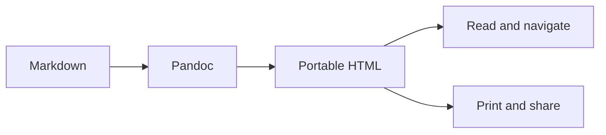
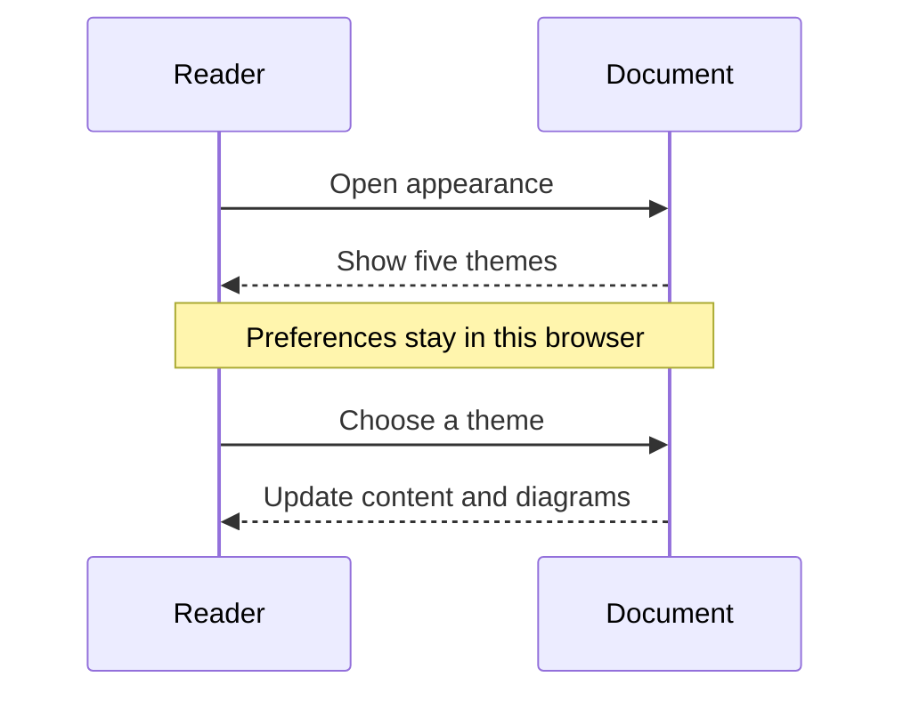

## A place for focused reading

Pandokary turns Markdown into a portable document. This specimen exercises the reader's typography, navigation, code, tables, images, and diagrams in each appearance.

Keep **important details** easy to find. Ordinary paragraphs, _emphasis_, [section links](#working-with-code), and `inline code` should remain readable together.

> A useful document gives its reader room to think. The controls stay close without competing with the content.

::: aside
**Remember**

Appearance and reading preferences are saved in this browser. Export the source again to pick up changes to the reader.
:::

### Details worth checking

- A short item with **emphasis**.
- A second item with `some code`.
  - Nested content uses the same palette.
  - Long links and names should wrap within the document.

- [x] Review the document
- [ ] Check the diagrams
- [ ] Share the export

## Working with code

```javascript
// Group notes by their project.
export function groupNotes(notes) {
  const groups = new Map();
  for (const note of notes) {
    const key = note.project ?? "Personal";
    const entries = groups.get(key) ?? [];
    entries.push(note);
    groups.set(key, entries);
  }
  return groups;
}

const notes = [
  { project: "Reader", title: "Theme audit", complete: true },
  { project: "Reader", title: "Keyboard checks", complete: false },
  { project: "Exports", title: "Print specimen", complete: false },
];

for (const [project, entries] of groupNotes(notes)) {
  console.log(`${project}: ${entries.length} notes`);
}
```

```diff
@@ Reader preferences @@
- themes: 10
+ themes: 5
```

### Comparing results

| Area       | What to check        | Expected result                         | Status |
| :--------- | :------------------- | :-------------------------------------- | :----- |
| Reading    | Fonts and scale      | Original typography                     | Ready  |
| Appearance | Five palettes        | Three light and two dark                | Ready  |
| Navigation | Keyboard and touch   | Visible focus and section state         | Review |
| Tables     | Horizontal scrolling | Header stays visible in the viewer      | Review |
| Export     | Printed pages        | Complete code without floating controls | Review |

## Following a process



### A conversation



## Equations and images

Inline math such as $E = mc^2$ should sit comfortably within the text.

$$
\int_0^1 x^2\,dx = \frac{1}{3}
$$


### සිංහල සටහන්

සිංහල සටහන් කියවීම සහ කොටස් වෙත යාම.

### The final section

Check the reading progress at the end of the document, then return to an earlier section through the table of contents.
